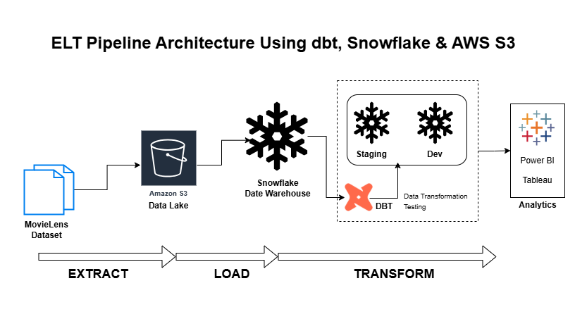

# 🎬 MovieLens ELT Pipeline | dbt · Snowflake · AWS S3

A **production-ready ELT data pipeline** built using the **MovieLens dataset**, demonstrating modern **cloud data engineering** practices with **dbt**, **Snowflake**, and **AWS S3**.



---

## 🚀 Project Overview
This project ingests raw MovieLens data from **AWS S3**, loads it into **Snowflake**, and transforms it using **dbt** to create **analytics-ready fact and dimension tables**.  
A **layered architecture** ensures **reliability, traceability, and scalability**.

---

## 🏗️ Architecture
- **Raw Layer:** Source data ingested as tables/views (system of record)  
- **Dev Layer:** Transformed **fact & dimension tables** optimized for analytics  
- Supports **incremental models** and **SCD Type 2 using snapshot**

---

## ⚙️ Tech Stack
- **AWS S3** – Data Lake  
- **Snowflake** – Cloud Data Warehouse  
- **dbt** – Transformations & Testing  
- **SQL** – Analytics & Modeling  

---

## 🔧 Setup Instructions

```bash
# Create virtual environment
python -m venv venv
venv\Scripts\activate   # Windows

# Install dbt for Snowflake
pip install dbt-snowflake==1.9.0

# Initialize dbt (Windows)
mkdir %userprofile%\.dbt
dbt init

---

## ⚙️ Complete Instructions
The complete instructions of the project are in **Movielens.sql** file

---
