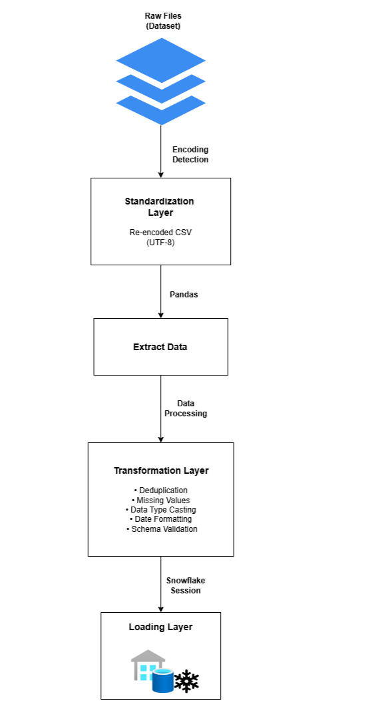

# Netflix ETL Pipeline

An end-to-end **Data Engineering ETL pipeline** designed to ingest, clean, transform, and load Netflix dataset into **Snowflake Cloud** using industry-standard best practices.

---

## 📊 Architecture Diagram

  

---

## 🔹 Project Overview

This project demonstrates the complete ETL lifecycle:

- Extracting raw Netflix data from CSV files
- Standardizing file encoding for data consistency
- Performing robust data transformations
- Handling schema validation and schema evolution
- Loading analytics-ready data into Snowflake warehouse

The pipeline is designed to be **scalable, reliable, and production-oriented**.

---

## 🔧 ETL Workflow

### Extract
- Detects CSV file encoding using `chardet`
- Re-encodes data into UTF-8 format
- Loads data into Pandas DataFrame

### Transform
- Removes duplicate records
- Handles missing and null values
- Normalizes data types
- Standardizes date formats
- Validates expected schema
- Supports schema evolution (new columns)

### Load
- Loads transformed data into Snowflake using Snowpark
- Auto-creates table if not present
- Ensures schema-safe writes
- Logs execution and validates load

---

## 🛠 Tech Stack

- **Programming:** Python
- **Data Processing:** Pandas
- **Data Warehouse:** Snowflake
- **ETL Framework:** Snowpark
- **Logging:** Python Logging
- **Version Control:** Git & GitHub

---

## 📂 Repository Structure

